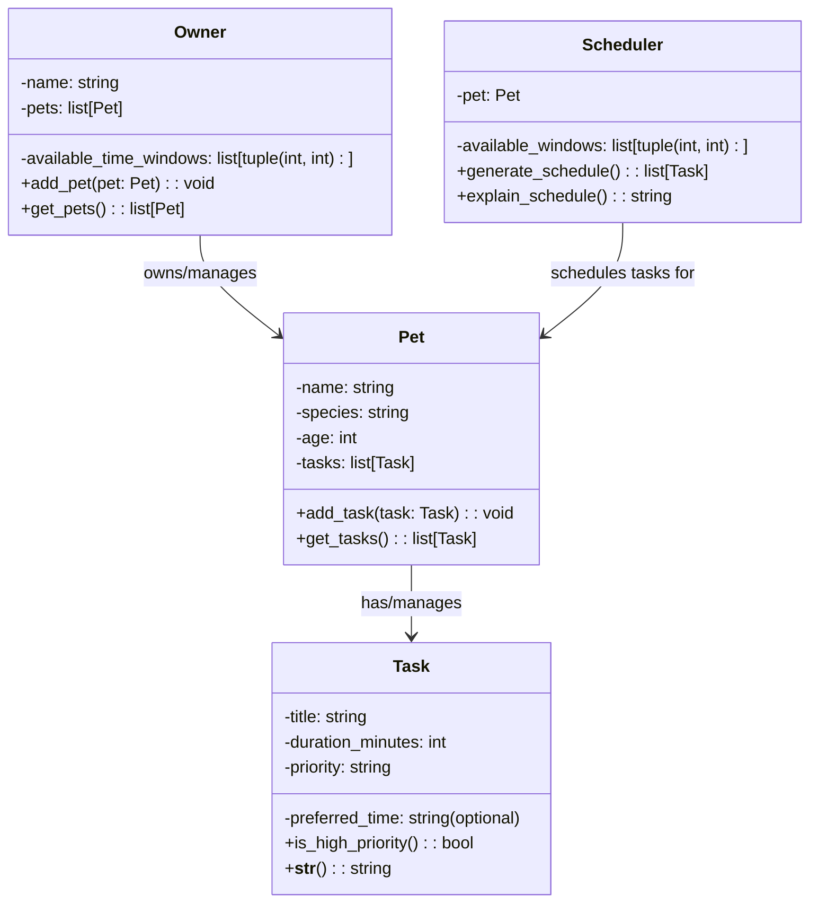

# PawPal+ Class Diagram

## Class Descriptions

**Owner**: Represents the pet owner with their daily time constraints and pets

**Pet**: Represents a pet with basic attributes (species, age) and associated care tasks

**Task**: Represents a single care task with duration, priority, and optional time preferences

**Scheduler**: The orchestrator that generates optimized daily schedules based on available time and task priorities
